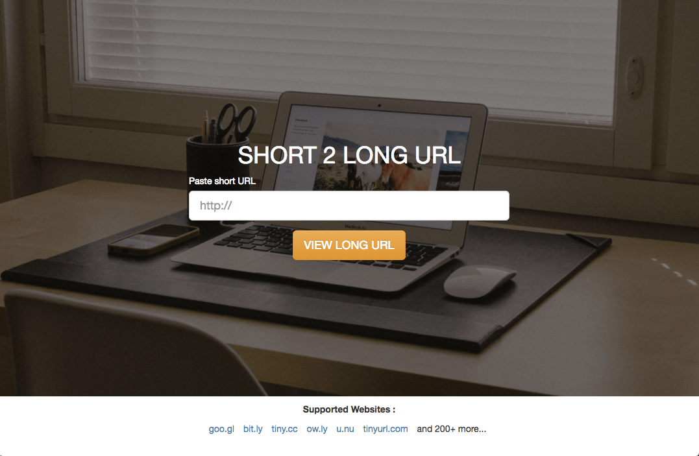
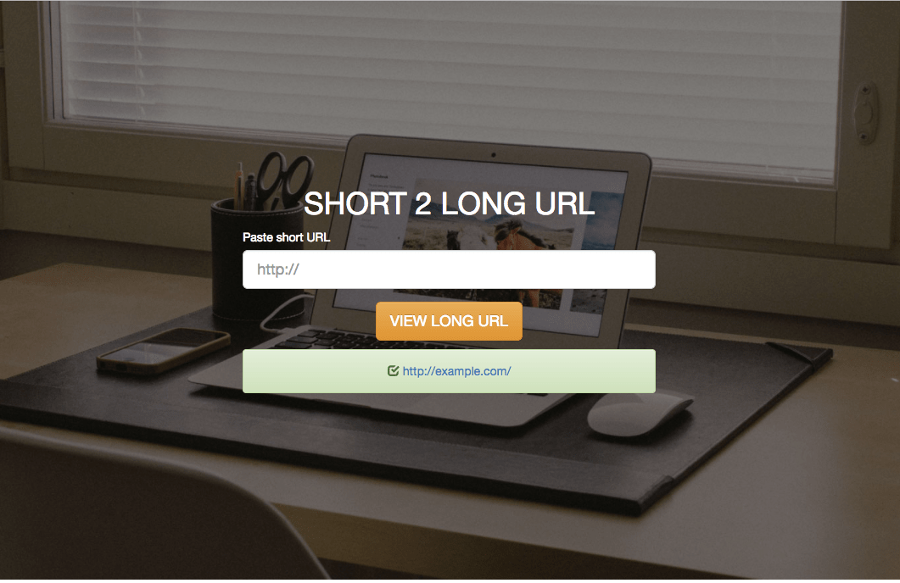

# short2longURL
Convert Short URL to Long URL.

Two modes : check one or multiple urls

Supported websites : goo.gl, bit.ly, tiny.cc, ow.ly, u.nu, tinyurl.com and 200+ more...

## Version 0.4
- Add function Authorized Websites List
- Add response code
- Add CSS Class "glyphicon-check" & "glyphicon-remove"

## Demo
https://demo.t-php.fr/short2longURL/

## Preview



## Installation

1. Download script
2. Unzip the package
3. Transfer on your server (local or online)
4. It's finish !

## Configuration

#### Autorized Websites
Edit 'index.php' or 'multiple-urls.php' and modifiy line : 
```php
$websites = array('goo.gl', 'bit.ly', 'tiny.cc');
```
For authorized all websites, array must be empty : 
```php
$websites = array();
```
#### Nb of maximum urls to check
Edit 'multiple-urls.php' file and change value to define 'NB_URLS_MAX'. In this example, you can check 5 urls :
```php
define('NB_URLS_MAX', '5');
```
